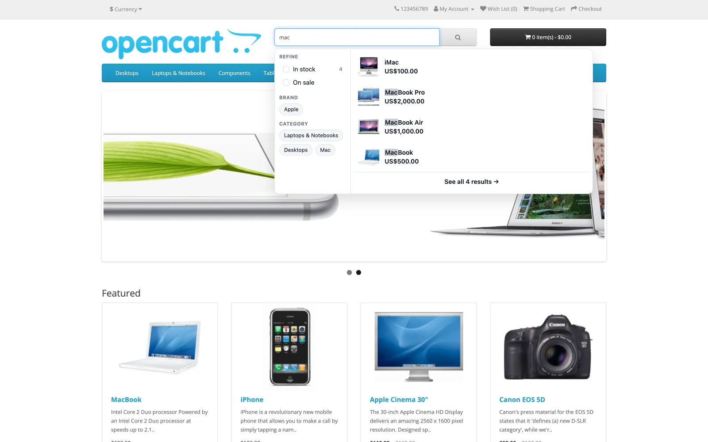
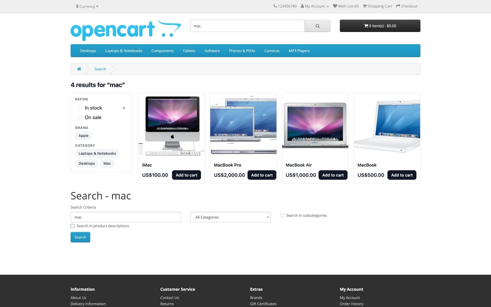

<p align="center">
  
</p>

<h1 align="center">NitroSearch for OpenCart</h1>

<p align="center">
  <strong>Amazon-quality search for OpenCart.</strong><br>
  Instant, typo-tolerant product search served from the cloud — without adding load to your shop.
</p>

<p align="center">
  <a href="https://nitrosearch.io/opencart">nitrosearch.io</a> &nbsp;·&nbsp;
  <a href="https://nitrosearch.io/pricing">Pricing</a> &nbsp;·&nbsp;
  <a href="https://nitrosearch.io/legal/privacy">Privacy</a> &nbsp;·&nbsp;
  <a href="CONTRIBUTING.md">Contributing</a>
</p>

<p align="center">
  <a href="https://github.com/NitroSearch/nitrosearch-for-opencart/releases/latest"></a>
  
  
  <a href="LICENSE"></a>
</p>

---

<p align="center">
  
</p>

NitroSearch is a hosted search service. This module syncs your OpenCart catalogue to it and lets it
serve instant, typo-tolerant search and filtering to your shoppers — every query goes straight from
the browser to our engine, so **your own server is never in the search path**. Search stays fast
even while your shop is busy, and this module is not on that path at all.

Works on **both current OpenCart majors** — see [Installing](#installing) for the archive to pick.

## Supported versions

| | |
|---|---|
| **OpenCart 4** | 4.0.x – 4.1.x |
| **OpenCart 3** | 3.0.x |
| **PHP** | 8.1+ |

**Both majors are current, which is unusual and worth saying plainly.** OpenCart 3.0.5.0 was
released in December 2025 — eight months *after* 4.1.0.3 — so 3.x is not a legacy line being
tolerated here. The two are not compatible with each other: a controller's directory, class name,
namespace and base class all differ, and the two installers disagree about where an archive's
contents belong. There is no single archive both accept, so this repository builds **two**.

Everything that carries logic is shared between them, verbatim. Only the files whose shape the
framework dictates are written twice.

## Installing

Download the archive for your major from the [Releases](../../releases) page.

### OpenCart 4 — `nitrosearch.ocmod.zip`

1. **Do not rename the file.** OpenCart 4 uses the archive's *filename* as the extension code — it
   decides both the install directory and the PHP namespace it registers, and it ignores the name
   inside the archive. A renamed download installs to the wrong place and nothing works. This is an
   OpenCart behaviour and the module cannot detect or correct it from inside.
2. Admin → **Extensions → Installer** → **Upload**, choose the file, then **Install** (the green +).
3. Admin → **Extensions → Extensions**, choose **Modules**, find **NitroSearch**, and install it.
   **Step 3 is required, not optional** — OpenCart 4 does not register an extension's code until a
   module of it is installed, and until then the storefront half of this module is unreachable.

### OpenCart 3 — `nitrosearch-oc3-<version>.ocmod.zip`

1. Admin → **Extensions → Installer** → **Upload**, choose the file.
2. Admin → **Extensions → Extensions**, choose **Modules**, find **NitroSearch**, and install it.

The filename does not matter on OpenCart 3.

### Upgrading

**Uninstall the old version's archive before uploading a new one**, from Admin → Extensions →
Installer. Both majors refuse an upload whose filename is already present, and OpenCart 3 tracks
installed files per upload — so uploading over an old install can leave the previous version's
files behind, which is exactly the situation where a stale class outlives the code that used it.

Uninstalling the **archive** does not touch your settings. Uninstalling the **module** (the red
minus in Extensions → Extensions → Modules) does: it removes this module's settings and its queue
table, and disconnects the shop. Reconnecting afterwards is one click, and your indexed catalogue
is kept on the service throughout.

## Keeping the catalogue in sync

Changes are queued the moment a product is added, edited, copied or deleted, and sent in the
background. **How often that background send runs is up to you.**

**Point your host's cron at the scheduled-sync address** shown on the module's Configure screen,
every few minutes. That is the arrangement this module is built around: OpenCart has no background
worker on either major, so a scheduled request is what does the work. The address is safe to call
as often as you like — each call does a bounded amount of work and stops.

```
*/5 * * * * curl -s "https://your-shop.example/index.php?route=extension/nitrosearch/module/nitrosearch/cron&token=YOUR-TOKEN" >/dev/null
```

**Without a cron the shop still syncs**, just more slowly: a storefront page view occasionally
picks up the queue instead, after the page has been sent to the shopper. A quiet shop with no cron
therefore syncs when someone visits it, which for a quiet shop is usually enough.

The address carries a token unique to your install. Keep it private — anyone who has it can make
your shop sync, which is a nuisance rather than a disclosure, but there is no reason to publish it.
It survives disconnecting and reconnecting, so a cron you set up once keeps working.

## The storefront search box

Once the shop is connected and verified, the module puts NitroSearch on your theme's existing
search input on every page. There is nothing to place in a layout and no template to edit.

Shoppers get results as they type, and on your shop's own search-results page the results grid is
replaced with ours — same page, same URL, your theme's own heading and refine form left in place.
Add-to-cart works from the results, including products with required options, which are sent to the
product page to choose them exactly as your theme's own button does.

<p align="center">
  
</p>

Nothing is emitted until the shop is connected **and** verified: before that there is no search key,
and a search box that cannot search is worse than none.

## Privacy

The module sends your catalogue — the same product data your shoppers already see — and nothing
else. It does not send customer records, addresses, payment details, or order contents.

It also does not report orders. Search-to-order attribution exists on some of our other connectors
and **is not built here**; if that changes, this section changes with it.

## Building from source

```bash
./bin/build-module.sh
```

Writes both archives to `dist/`. They are release assets rather than tracked files: any tagged
commit reproduces them. Cutting a release: [RELEASING.md](RELEASING.md). What changed between
versions: [CHANGELOG.md](CHANGELOG.md).

## Contributing

See [CONTRIBUTING.md](CONTRIBUTING.md).

## Licence

[GPL-3.0](LICENSE), matching OpenCart itself.
